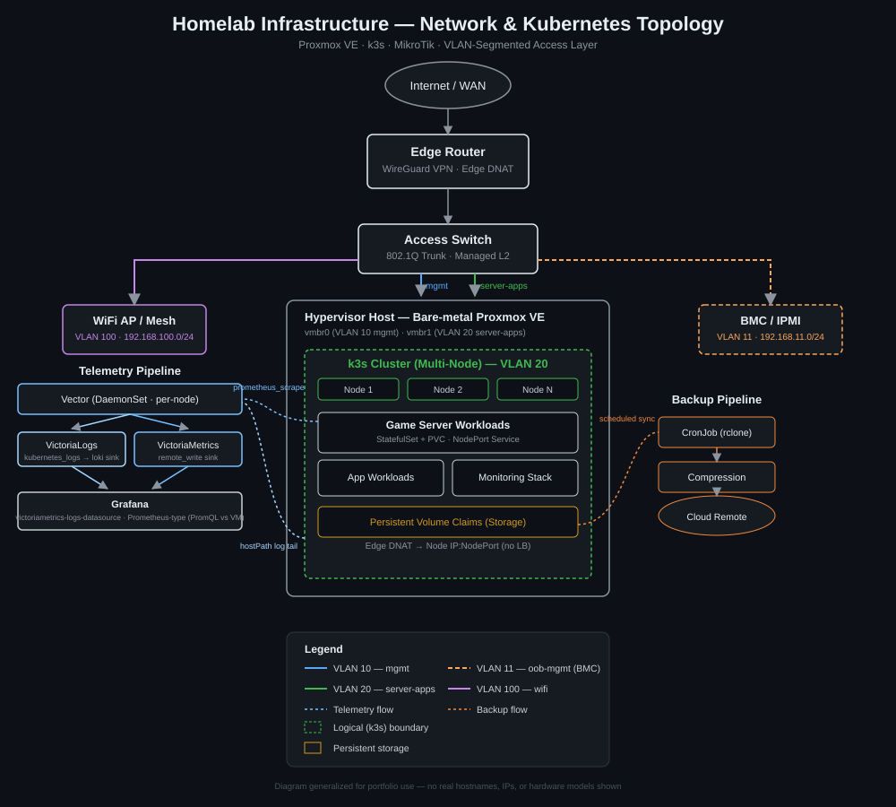

# Homelab

Personal homelab running Proxmox VE with a k3s cluster hosting Minecraft servers and a self-hosted monitoring stack.

---

## Infrastructure Diagram

---

## k3s Cluster

### Minecraft (`minecraft` namespace)

| Server | Type | Version | NodePort |
|---|---|---|---|
| Crucial 2 | CurseForge modpack (Forge) | 1.16.5 / Java 11 | 30001 |
| Vanilla Paper | Paper | Latest / Java 25 | 30002 |

Both servers expose a JMX metrics endpoint scraped by Vector every 15 seconds. A CronJob runs nightly at 2:30 AM, archives both world PVCs, and uploads them to Google Drive via `rclone`. Backups older than 2 days are automatically pruned.

### Monitoring (`monitoring` namespace)

| Component | Image | Port | Role |
|---|---|---|---|
| Vector | `timberio/vector:0.38.0` | — | DaemonSet; collects k8s logs and MC JMX metrics |
| VictoriaMetrics | `victoriametrics/victoria-metrics:v1.101.0` | 8428 | TSDB; 14-day retention |
| VictoriaLogs | `victoriametrics/victoria-logs:v0.34.0` | 9428 | Log store; 14-day retention |
| Grafana | `grafana/grafana:10.4.1` | 3000 | Dashboards |
